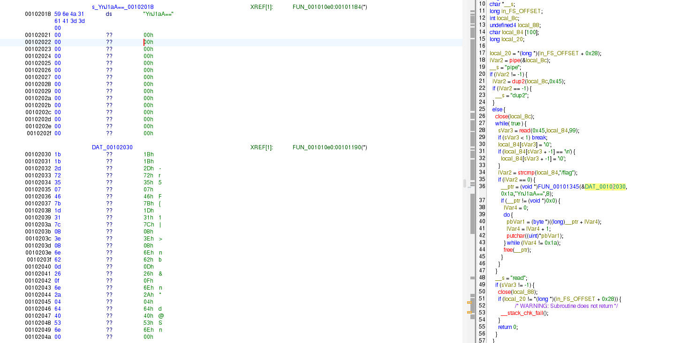

## Overview
В глубинах системы, затерянный среди множества других, дремлет одинокий процесс. Он не говорит и не слушает обычные пути. Его единственная цель — хранить тайну и ждать того, кто знает волшебное слово. Шепни ему на ухо правильную команду, и он откроет тебе свои секреты.

---
## Анализ кода
### 1. Чтение из необычного fd

Ключевой фрагмент дизасма:

```c
iVar2 = pipe(&local_8c);
if (iVar2 != -1) {
    iVar2 = dup2(local_8c, 0x45);   // 0x45 = 69
    ...
    while (true) {
        sVar3 = read(0x45, local_84, 99);
        ...
        if (strcmp(local_84, "/flag") == 0) {
            // вывести флаг
        }
    }
}

```

Что это значит:
- бинарь НЕ читает со stdin (fd 0),
- бинарь читает с **fd 69**,
- и ждёт там строку `"/flag"`.  
Это такой маленький троллинг: если просто запустить бинарь и что-то ему печатать — он не увидит. Нужно либо подцепиться к fd 69, либо… просто вытащить данные из `.rodata` и расшифровать самим (что проще).
---
### 2. Где лежат данные

В дизасме у тебя было:
`s_YnJ1aA==_00102018  ds  "YnJ1aA==" ... DAT_00102030:   1b 1b 2d 72 35 07 46 7b 1d 31 7c 08 3e 08 6e 62   0d 26 0f 6e 2a 04 64 40 53 6e`

- по адресу `0x00102018` лежит строка **ключа**: `"YnJ1aA=="`,
- по адресу `0x00102030` лежит **зашифрованный флаг**, 26 байт (`0x1a`).

В коде это выглядело так:
`__ptr = (void *)FUN_00101345(&DAT_00102030, 0x1a, "YnJ1aA==", 8);`
То есть вызывается функция `FUN_00101345(...)`, которой передали:

- указатель на зашифрованные данные,
- длину (`0x1a`),
- ключ `"YnJ1aA=="`,
- длину ключа `8`.



---
### 3. Что делает `FUN_00101345`

Эта функция была сильно «кривая» из-за декомпиляции, но по содержимому она очень простая: выделить буфер и пройтись по всем байтам, сделав XOR с повторяющимся ключом.

Нормальный вид:

```c
unsigned char *decode(const unsigned char *data, size_t len,
                      const unsigned char *key, size_t key_len)
{
    if (!data || !len || !key || !key_len) return NULL;

    unsigned char *out = malloc(len);
    if (!out) return NULL;

    for (size_t i = 0; i < len; i++) {
        out[i] = data[i] ^ key[i % key_len];
    }
    return out;
}

```
Это классический «ручной xor-криптор» из CTF.

---
## Восстановление флага вручную

Раз у нас есть:
- шифртекст (26 байт),
- ключ (8 байт, строка `"YnJ1aA=="`),
то можно просто расшифровать всё локально.
### Скрипт (Python)
```Python
cipher = [
    0x1b, 0x1b, 0x2d, 0x72, 0x35, 0x07, 0x46, 0x7b,
    0x1d, 0x31, 0x7c, 0x08, 0x3e, 0x08, 0x6e, 0x62,
    0x0d, 0x26, 0x0f, 0x6e, 0x2a, 0x04, 0x64, 0x40,
    0x53, 0x6e
]

key = b"YnJ1aA=="

flag = bytes(c ^ key[i % len(key)] for i, c in enumerate(cipher))
print(flag)
```