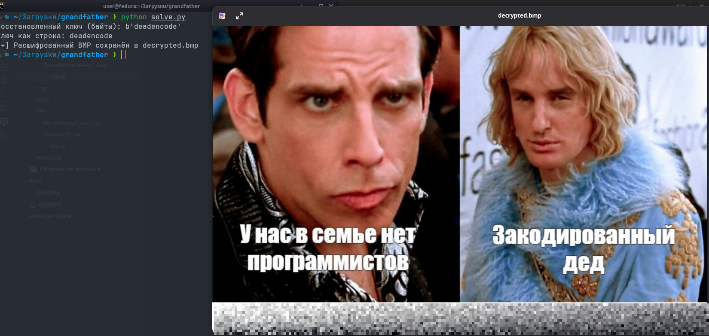

# Закодированный дед
## Overview

**Категория:** Crypto  
**Описание:** У меня есть картинка в старом формате BMP и код, которым ее закодировали. Но ключ от шифра уже утерян. Помогите расшифровать картинку.
**Сложность:** Easy

---

## Анализ

### Разведка
Что у нас есть:
- `encrypt.py` — сразу смотрим код
- `encrypted.bmp` — бинарь неизвестного содержимого, но по расширению похоже на BMP

Открываем `encrypt.py` и видим:
- Чтение исходного BMP-файла как байтов
- Генерация фиксированного ключа длиной 10 байт
- Шифрование: побайтовый XOR каждого байта изображения с повторяющимся ключом (`key[i % len(key)]`)
- Запись результата в `encrypted.bmp`

Вывод: это **повторяющийся XOR-шифр** с неизвестным ключом длиной 10.

### Детальный анализ

#### Структура шифрования
Типичный фрагмент кода шифрования выглядит так (упрощённо):

```python
key = b"??????????"      # длина 10 байт
data = open("original.bmp", "rb").read()

enc = bytes(d ^ key[i % len(key)] for i, d in enumerate(data))
open("encrypted.bmp", "wb").write(enc)
```

Ключ не даётся напрямую, но:
- Формат BMP — стандартный, с фиксированной сигнатурой и известной структурой заголовка.
- Это позволяет использовать атаку по известному открытому тексту (known-plaintext attack).

#### BMP как источник известного текста

Первые байты нормального BMP-файла всегда:
- `0x42 0x4D` — ASCII `'B' 'M'`
- Далее 4 байта — размер файла в little-endian
- Затем несколько зарезервированных байт, часто `0x00`

Так как `encrypted.bmp` — это XOR оригинального BMP с ключом, мы можем:
1. Взять первые 10 байт `encrypted.bmp`
2. Предположить, какими они **должны** быть в честном BMP
3. Восстановить каждый байт ключа по формуле:

```text
key[i] = encrypted[i] XOR expected_plaintext[i]
```

Где `expected_plaintext` — это:
- `expected[0] = ord('B')`
- `expected[1] = ord('M')`
- `expected[2..5] = размер файла (len(cipher)) в little-endian`
- `expected[6..9] = 0x00` (часто зарезервированные байты)

Посчитав так ключ, получаем строку:

```text
key = b"deadencode"
```

То есть ключ — `"deadencode"`.

Дальше задача сводится к простой операции:

```python
plain[i] = encrypted[i] XOR key[i % 10]
```

После расшифровки файл становится валидным BMP-изображением. Открыв его, видим флаг:

---

## Решение

### Подход

1. Используем знание формата BMP, чтобы провести атаку по известному открытому тексту на XOR.
2. Восстанавливаем все 10 байт ключа.
3. Расшифровываем весь файл `encrypted.bmp` повторяющимся XOR-ом.
4. Открываем полученный `decrypted.bmp` и считываем флаг с картинки (глазами или через OCR).

### Эксплойт / Скрипт

Ниже полностью автоматический скрипт, который:
- Восстанавливает ключ по заголовку BMP
- Расшифровывает `encrypted.bmp`
- Сохраняет результат в `decrypted.bmp`

```python
#!/usr/bin/env python3
import pathlib

KEY_LEN = 10

def recover_key(cipher: bytes) -> bytes:
    """
    Восстанавливаем 10-байтный ключ по структуре BMP:
    - [0..1]  : 'B', 'M'
    - [2..5]  : размер файла (len(cipher), little-endian)
    - [6..9]  : зарезервировано, обычно 0x00 0x00 0x00 0x00
    """
    key = [0] * KEY_LEN

    # 1. 'BM' в начале файла
    key[0] = cipher[0] ^ ord('B')
    key[1] = cipher[1] ^ ord('M')

    # 2. Размер файла (4 байта) лежит по смещению 2
    size_bytes = len(cipher).to_bytes(4, "little")
    for i in range(4):
        key[2 + i] = cipher[2 + i] ^ size_bytes[i]

    # 3. Зарезервированные 4 байта (6..9) = 0x00
    for i in range(4):
        key[6 + i] = cipher[6 + i] ^ 0x00  # т.е. просто cipher[6+i]

    return bytes(key)

def xor_decrypt(cipher: bytes, key: bytes) -> bytes:
    key_len = len(key)
    return bytes(c ^ key[i % key_len] for i, c in enumerate(cipher))

def main():
    enc_path = "encrypted.bmp"   # зашифрованный файл из задания
    out_path = "decrypted.bmp"   # сюда сохраним расшифровку

    cipher = pathlib.Path(enc_path).read_bytes()

    key = recover_key(cipher)
    print("Восстановленный ключ (байты):", key)
    try:
        print("Ключ как строка:", key.decode("ascii"))
    except UnicodeDecodeError:
        print("Ключ не полностью ASCII, но это не критично.")

    plain = xor_decrypt(cipher, key)
    pathlib.Path(out_path).write_bytes(plain)

    print(f"[+] Расшифрованный BMP сохранён в {out_path}")

    # Далее можно открыть картинку и глазами найти флаг:

if __name__ == "__main__":
    main()
```

### Шаги выполнения

1. Кладём `encrypted.bmp` и скрипт `solve.py` в одну директорию.
2. Запускаем:
```bash
python3 solve.py
``` 
3. Скрипт:
    - Считает `encrypted.bmp`
    - По первым 10 байтам и ожиданиям формата BMP восстановит ключ
    - Расшифрует всё содержимое и запишет `decrypted.bmp`
4. Открываем `decrypted.bmp` любым просмотрщиком изображений.
5. Читаем флаг с картинки:

