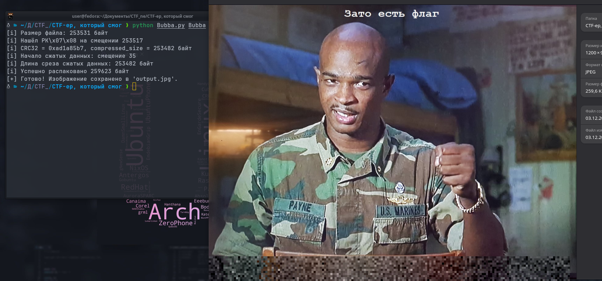

# CTF-ер, который смог
## Overview

**Категория:** Forensic  
**Описание:** — Пейн, я не чувствую центральной директории!  
— Буба, у тебя ее нет!
**Сложность:** Medium

---
## Анализ

### Разведка
Что нам дали:
- один файл `Bubba` без расширения;
- текстовую подсказку про «центральную директорию» (намёк на структуру ZIP-архива).

Первичная проверка:
- `file Bubba` → «data» (формат не опознан);
- `xxd Bubba | head` показывает, что начало файла не похоже на стандартную сигнатуру ZIP `PK\x03\x04`, вместо неё видны байты, которые в ASCII читаются как `fifu...`

Отсюда гипотеза: это повреждённый/замаскированный ZIP-архив, у которого:
- подпись `PK..` в начале заменили на что-то ещё;
- центральная директория (End of Central Directory) либо удалена, либо намеренно не используется.

### Детальный анализ
1. **Поиск ZIP-структур внутри файла**
   Несмотря на сломанный заголовок, сигнатуры внутренних структур ZIP никто не отменял.  
   Сканируем бинарник по байтам и ищем последовательность `PK\x07\x08` — это сигнатура **Data Descriptor** в формате ZIP, которая записывается после данных файла, когда заранее неизвестен размер (установлен bit 3 в general purpose flag). В конце `Bubba` такой блок действительно находится.
2. **Разбор Data Descriptor**
   Формат data descriptor в нашем случае:
   `PK 07 08 | CRC32 (4 байта LE) | compressed_size (4 байта LE) | [uncompressed_size]`
   Из этих полей нам нужны только `CRC32` и `compressed_size`.  
   Зная `compressed_size`, можно вычислить начало сжатых данных:    
   `data_start = dd_pos - compressed_size`
3. **Извлечение и распаковка Deflate**
   Берём срез `data[data_start:dd_pos]` — это сжатые данные.  
   Предполагаем, что метод сжатия стандартный (Deflate, как обычно в ZIP) и пробуем распаковать как **raw deflate** (`wbits=-15`) через `zlib`.  
   Распаковка проходит успешно, на выходе ~259 KB данных, начинающихся с маркера JPEG (`FF D8 FF ...` и строки `JFIF`). Значит, внутри архива спрятано изображение. Bubba  
4. **Поиск флага на изображении**    
Сохраняем распакованные данные в `output.jpg` и открываем картинку.  

---

## Решение

### Подход
Ключевая идея:
1. Игнорировать поломанный «верх» файла и искать внутри него следы ZIP-структур.
2. Использовать сигнатуру `PK\x07\x08` и поле `compressed_size`, чтобы аккуратно вырезать сжатые данные.
3. Распаковать их как raw-Deflate и сохранить полученный JPEG.
4. Считать флаг с картинки.

### Эксплойт / Скрипт

Ниже Python-скрипт, который автоматизирует все шаги: ищет `PK\x07\x08`,  
вырезает блок сжатых данных, распаковывает его и сохраняет JPEG.

```python
#!/usr/bin/env python3
import sys
import struct
import zlib


def extract_jpeg_from_bubba(in_path: str, out_path: str = "output.jpg") -> None:
    with open(in_path, "rb") as f:
        data = f.read()

    print(f"[i] Размер файла: {len(data)} байт")

    # Ищем последний PK\x07\x08 — data descriptor
    dd_sig = b"PK\x07\x08"
    dd_pos = data.rfind(dd_sig)
    if dd_pos == -1:
        raise RuntimeError("Не найдено PK\\x07\\x08 (data descriptor).")

    print(f"[i] Нашёл PK\\x07\\x08 на смещении {dd_pos}")

    # Нам нужны только CRC32 и compressed_size (4 + 4 байта после сигнатуры)
    # Проверяем, что этих 8 байт хватает
    if dd_pos + 4 + 8 > len(data):
        have = len(data) - (dd_pos + 4)
        raise RuntimeError(
            f"Data descriptor усечён: есть только {have} байт после сигнатуры."
        )

    crc32, comp_size = struct.unpack("<II", data[dd_pos + 4: dd_pos + 12])
    print(f"[i] CRC32 = 0x{crc32:08x}, compressed_size = {comp_size} байт")

    # Начало сжатых данных — ровно comp_size байт перед PK\x07\x08
    data_start = dd_pos - comp_size
    if data_start < 0:
        raise RuntimeError(
            f"Невалидный comp_size: start={data_start} < 0, что-то не сходится."
        )

    print(f"[i] Начало сжатых данных: смещение {data_start}")
    compressed = data[data_start:dd_pos]
    print(f"[i] Длина среза сжатых данных: {len(compressed)} байт")

    # Распаковка raw Deflate (как в ZIP без zlib-заголовка)
    try:
        decompressed = zlib.decompress(compressed, -15)
    except zlib.error as e:
        raise RuntimeError(f"Ошибка при распаковке Deflate: {e!r}")

    print(f"[i] Успешно распаковано {len(decompressed)} байт")

    # Небольшая проверка, что это JPEG
    if not (decompressed.startswith(b"\xff\xd8\xff") or b"JFIF" in decompressed[:20]):
        print("[!] Предупреждение: начало данных не похоже на JPEG, но всё равно сохраняю.")

    with open(out_path, "wb") as out:
        out.write(decompressed)

    print(f"[+] Готово! Изображение сохранено в '{out_path}'.")


if __name__ == "__main__":
    if len(sys.argv) < 2:
        print("Использование: python3 2.py Bubba [output.jpg]")
        sys.exit(1)

    input_file = sys.argv[1]
    output_file = sys.argv[2] if len(sys.argv) >= 3 else "output.jpg"
    extract_jpeg_from_bubba(input_file, output_file)
```

### Шаги выполнения

1. Скачиваем файл `Bubba`.
2. Запускаем скрипт:
    `python3 Bubba.py Bubba output.jpg`
3. Открываем `output.jpg` любым просмотрщиком изображений.

