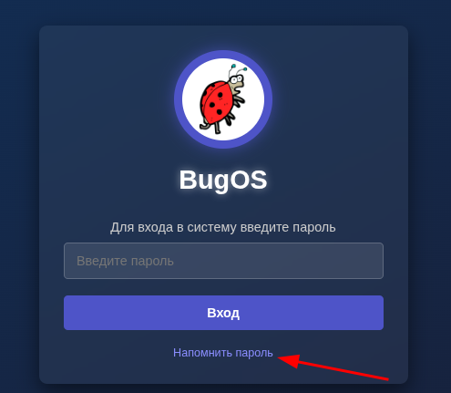
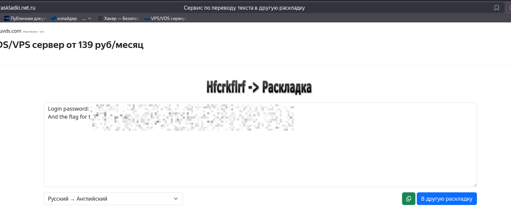
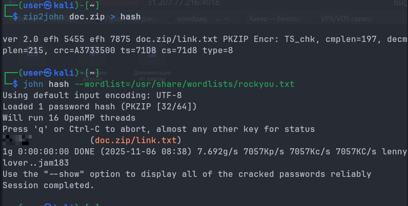
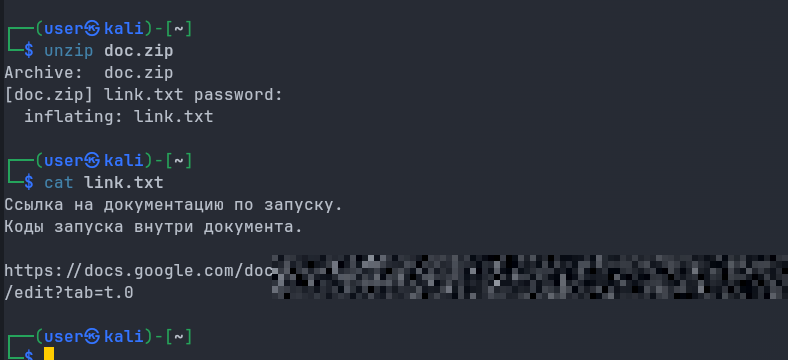
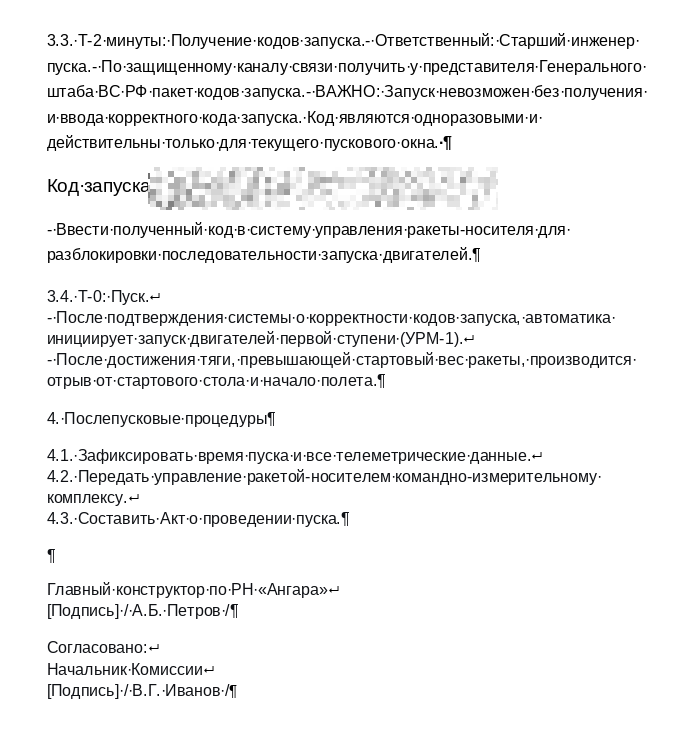
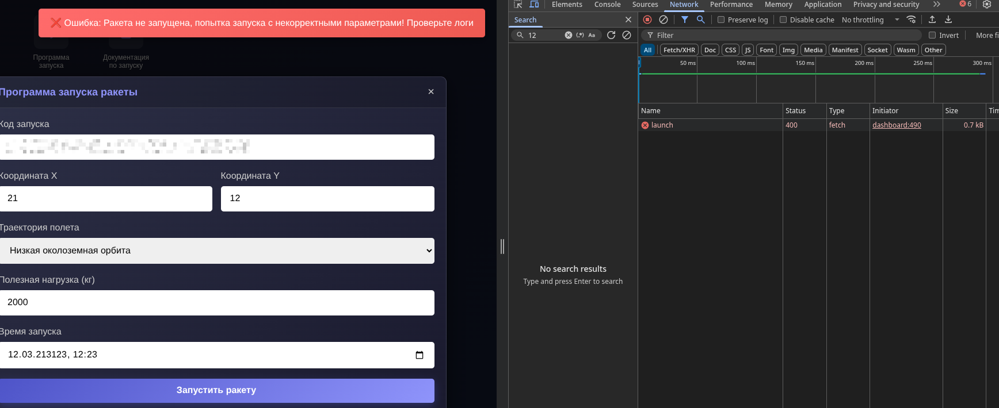
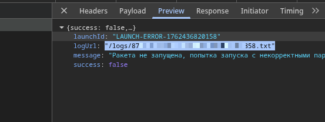
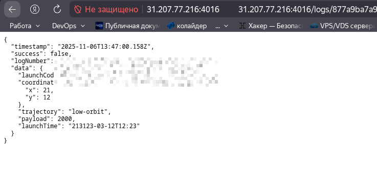
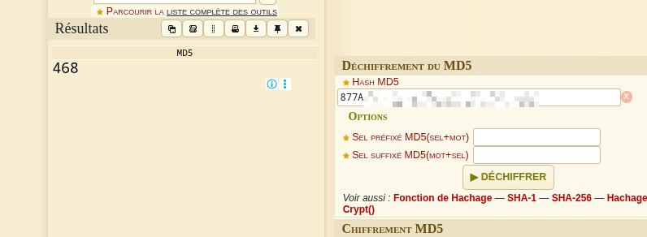

## Overview

Эта первая задача из трех связанных. Решать задачи можно только по порядку, т.к слещующие части связаны с предыдущими.  
Цель миссии всех трех задач – запустить ракету в космос.

Сперва нужно войти в систему управления полетами, но пароль потерялся, нужно его как-то восстановить.  
Авторизацию в нашу новую ОС BugOS настраивал приглашенный специалист. Он оставил описание по восстановлению пароля, но что-то с этим текстом не так.
Адрес: [http://31.207.77.216:4016/](http://31.207.77.216:4016/)

---
Перед решением этой задачи, нужно решить первую часть «[Ангара-1: Вход в ОС](https://ctf.bug-makers.ru/challenges#%D0%90%D0%BD%D0%B3%D0%B0%D1%80%D0%B0-1:%20%D0%92%D1%85%D0%BE%D0%B4%20%D0%B2%20%D0%9E%D0%A1-47)».
Отлично, мы в системе! Теперь необходимо найти коды запуска ракеты.  
Флаг для сдачи: BugCTF{код_запуска}
Адрес: [http://31.207.77.216:4016/](http://31.207.77.216:4016/)

---
Перед решением этой задачи, нужно решить первую и вторую части – «[Ангара-1: Вход в ОС](https://ctf.bug-makers.ru/challenges#%D0%90%D0%BD%D0%B3%D0%B0%D1%80%D0%B0-1:%20%D0%92%D1%85%D0%BE%D0%B4%20%D0%B2%20%D0%9E%D0%A1-47)» и «[Ангара-2: Коды запуска](https://ctf.bug-makers.ru/challenges#%D0%90%D0%BD%D0%B3%D0%B0%D1%80%D0%B0-2:%20%D0%9A%D0%BE%D0%B4%D1%8B%20%D0%B7%D0%B0%D0%BF%D1%83%D1%81%D0%BA%D0%B0-48)».

Ура, теперь у нас есть коды запуска, остается найти нужные параметры для пуска ракеты.  
В прошлом году, сразу после настройки BugOS, был выполнен пробный пуск с правильными параметрами, тогда все прошло успешно. А значит система рабочая, и сейчас тоже получится!

Адрес: [http://31.207.77.216:4016/](http://31.207.77.216:4016/)

---

Заходим на сайт и сразу же видим кнопку напомнить пароль скачиваем текстовик

Открываем текстовик и предпологаем что просто расскладку поменяли находим сервис и копируем текст и текстовика

Использовали пароль и зашли в BugOS

Скачиваем картинку из вкладки Девчонки и вкладки документы по запуску
Архив запоролен
Используем метод lsb для извлечение информации из изображения

Нам сообщает с помощью какого словарю можно найти пароль для архива

С помощью john извлекаем хэш и получаем пароль

Разархивируем архив и получам ссылку на док 

Находим код запуска увеличиваем шрифт и меняем цвет

Код запуска является флагом для Ангара-2

Пытаемся запустить ракету но у нас не получается

Смотрим ответ от сервера и видим лог url

Переходим на ссылке видим ответ сервера вспоминаем что в описание написано что первый запуск был правильный ищем первый запуск

Предположим что это md5 проверяем и точно

Кодируем цифру 1 и получаем хэш

Заменяем наш хэш на только что полученный и как раз получаем правильный запуск

Вводим данные в запуск и получаем флаг
