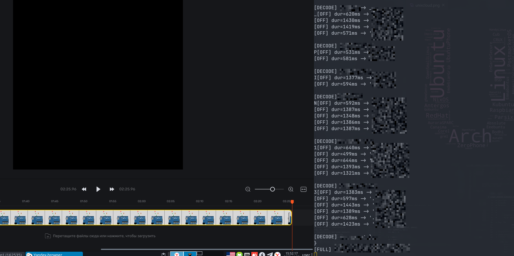

# Морзянка на Arduino

## Overview

**Категория:** MISC  
**Описание:** Светодиод передает флаг в формате азбуки Морзе. Нужно считать его послание – это флаг.

**Эмулятор работы Arduino с тестовым флагом:** https://wokwi.com/projects/441825314085368833

**Файлы:**
- Код передачи сигнала (`morze.ino`)
- Видео-запись передачи настоящего флага

---

## Анализ

### Изучение кода

Из `morze.ino` извлекаем алфавит Морзе, который использует Arduino для передачи сообщения.

### Подготовка видео

Видео загружаем в любой редактор и замедляем его до скорости 0.5x для более точного распознавания.

### Алгоритм скрипта

Скрипт работает по принципу: **"моргание → скриншот → яркость → Морзе → текст"**

Основные этапы:
1. **Выделение области, где моргает диод**
2. **Калибровка по выключенному состоянию** (чтобы понять, что такое "темно")
3. **Фаза обучения:** измеряем реальные длительности "горит" и "не горит"
4. **Построение порогов** (точка/тире, пауза между буквами, пауза между словами)
5. **Непрерывная расшифровка и вывод текста**, пока не придёт `}`

---

## Решение

### Эксплойт (Python скрипт)

```python
import time
from pynput import mouse
from PIL import ImageGrab

CHECK_INTERVAL = 0.03
DEBUG = True

MORSE_TABLE = {
    ".-": "A", "-...": "B", "-.-.": "C", "-..": "D", ".": "E", "..-.": "F",
    "--.": "G", "....": "H", "..": "I", ".---": "J", "-.-": "K", ".-..": "L",
    "--": "M", "-.": "N", "---": "O", ".--.": "P", "--.-": "Q", ".-.": "R",
    "...": "S", "-": "T", "..-": "U", "...-": "V", ".--": "W", "-..-": "X",
    "-.--": "Y", "--..": "Z",
    "-----": "0", ".----": "1", "..---": "2", "...--": "3", "....-": "4",
    ".....": "5", "-....": "6", "--...": "7", "---..": "8", "----.": "9",
    "..--.-": "_", "-.--.": "{", "-.--.-": "}",
}

# ---------- выбираем область ----------
clicked_points = []

def on_click(x, y, button, pressed):
    if not pressed:
        return
    clicked_points.append((x, y))
    print(f"Точка {len(clicked_points)}: {x},{y}")
    if len(clicked_points) >= 4:
        return False

print("Кликни 4 точки вокруг диода (сейчас он выключен).")
with mouse.Listener(on_click=on_click) as listener:
    listener.join()

xs = [p[0] for p in clicked_points]
ys = [p[1] for p in clicked_points]
left, top, right, bottom = min(xs), min(ys), max(xs), max(ys)
print(f"Область: {left, top, right, bottom}")

# маленький 5x5 в центре
cx = int((left + right) / 2)
cy = int((top + bottom) / 2)
SAMPLE_BOX = (cx - 2, cy - 2, cx + 3, cy + 3)

def get_small_brightness():
    img = ImageGrab.grab(bbox=SAMPLE_BOX)
    pixels = list(img.getdata())
    mb = 0
    for r, g, b in pixels:
        bright = 0.299 * r + 0.587 * g + 0.114 * b
        if bright > mb:
            mb = bright
    return mb

# ---------- калибровка по ВЫКЛ ----------
print("Калибруюсь 1 сек на ВЫКЛ...")
cal = []
t0 = time.time()
while time.time() - t0 < 1.0:
    cal.append(get_small_brightness())
    time.sleep(0.03)

off_level = sum(cal) / len(cal) if cal else 100
BRIGHTNESS_THRESHOLD = off_level + 25
print(f"Калибровка: off={off_level:.1f}, threshold={BRIGHTNESS_THRESHOLD:.1f}")
print("Режим обучения: жду первые мигания...")

# ---------- обучение ----------
on_durs = []
off_durs = []

is_signal = False
last_change = time.time()
first_on_seen = False

LEARNING = True

DOT_THRESHOLD = 0.4
LETTER_GAP_MIN = 0.6
WORD_GAP_MIN = 1.0

current_morse = ""
decoded_text = ""
last_release_time = time.time()

def build_thresholds(on_durs, off_durs):
    on_sorted = sorted(on_durs)
    n = len(on_sorted)
    low_part = on_sorted[:max(1, n // 3)]
    high_part = on_sorted[-max(1, n // 3):]
    dot_est = sum(low_part) / len(low_part)
    dash_est = sum(high_part) / len(high_part)
    dot_threshold = (dot_est + dash_est) / 2.0

    off_sorted = sorted(off_durs)
    unit_gap = off_sorted[0]
    letter_gap_min = unit_gap * 2.2
    word_gap_min = unit_gap * 5.5
    return dot_threshold, letter_gap_min, word_gap_min, dot_est, dash_est, unit_gap

def decode_current_morse():
    global current_morse, decoded_text
    if not current_morse:
        return
    ch = MORSE_TABLE.get(current_morse, "?")
    print(f"\n[DECODE] {current_morse} -> {ch}")
    print(ch, end="", flush=True)

    decoded_text += ch

    if ch == "}":
        print(f"\n[FULL] {decoded_text}")
        decoded_text = ""

    current_morse = ""

try:
    while True:
        brightness = get_small_brightness()
        now = time.time()
        state = brightness > BRIGHTNESS_THRESHOLD

        if state != is_signal:
            dur = now - last_change

            if is_signal:
                # закончилось "горит"
                first_on_seen = True
                on_durs.append(dur)
                if not LEARNING:
                    if dur < DOT_THRESHOLD:
                        current_morse += "."
                        if DEBUG:
                            print(f"[OFF] dur={dur*1000:.0f}ms -> '.' ({current_morse})")
                    else:
                        current_morse += "-"
                        if DEBUG:
                            print(f"[OFF] dur={dur*1000:.0f}ms -> '-' ({current_morse})")
                else:
                    if DEBUG:
                        print(f"[LEARN ON ] dur={dur*1000:.0f}ms")

                last_release_time = now

            else:
                # закончилось "выкл"
                if not first_on_seen:
                    if DEBUG:
                        print(f"[IGNORE first OFF] dur={dur*1000:.0f}ms")
                else:
                    off_durs.append(dur)
                    if LEARNING:
                        if DEBUG:
                            print(f"[LEARN OFF] dur={dur*1000:.0f}ms")
                    else:
                        if dur >= WORD_GAP_MIN:
                            decode_current_morse()
                            print(" ", end="", flush=True)
                        elif dur >= LETTER_GAP_MIN:
                            decode_current_morse()

            is_signal = state
            last_change = now

            # закончили обучение?
            if LEARNING and len(on_durs) >= 6 and len(off_durs) >= 6:
                (DOT_THRESHOLD,
                 LETTER_GAP_MIN,
                 WORD_GAP_MIN,
                 dot_est,
                 dash_est,
                 unit_gap) = build_thresholds(on_durs, off_durs)

                print("\n=== Обучение закончено ===")
                print(f"dot_est={dot_est*1000:.0f}ms  dash_est={dash_est*1000:.0f}ms")
                print(f"DOT_THRESHOLD={DOT_THRESHOLD*1000:.0f}ms")
                print(f"unit_gap={unit_gap*1000:.0f}ms")
                print(f"LETTER_GAP_MIN={LETTER_GAP_MIN*1000:.0f}ms")
                print(f"WORD_GAP_MIN={WORD_GAP_MIN*1000:.0f}ms")
                print("Перехожу в режим декодирования...\n")
                LEARNING = False

        # страховка
        if (not LEARNING) and (not is_signal) and first_on_seen:
            if now - last_release_time >= WORD_GAP_MIN:
                decode_current_morse()
                last_release_time = now

        time.sleep(CHECK_INTERVAL)

except KeyboardInterrupt:
    print("\nВыход.")
    decode_current_morse()
```

### Шаги выполнения

1. Открыть видео с морганием светодиода
2. Запустить Python-скрипт
3. Кликнуть 4 точки вокруг светодиода для определения области
4. Дождаться калибровки и обучения
5. Скрипт автоматически расшифрует сообщение
6. Получить флаг

---

## Результат



Скрипт автоматически распознаёт морзянку и выводит декодированный текст с флагом.

---

## Инструменты

- Python 3
- `pynput` для захвата кликов мыши
- `PIL/Pillow` для захвата и анализа изображений с экрана
- Видео-редактор для замедления записи
