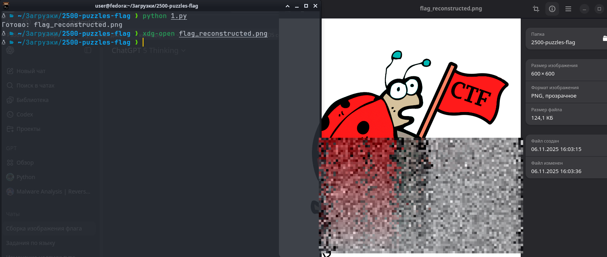

# Пазл из 2500 кусочков

## Overview

**Категория:** MISC  
**Описание:** Исходную картинку, где написан флаг, разрезали на 2500 равных частей. Чтобы прочитать флаг, нужно собрать все на место.

**Детали:**
- Части пазлов пронумерованы слева направо и сверху вниз
- Исходное изображение имеет размер 600×600 пикселей
- Всего 2500 частей

---

## Анализ

### Математика задачи

Из условия:
- 600×600 и 2500 частей → значит картинку нарезали на сетку **50×50** (потому что √2500 = 50)
- Размер одного фрагмента: 600 / 50 = **12 пикселей** → каждый кусочек 12×12
- Нумерация "слева направо, сверху вниз" означает:
  - Часть №1 — это верхний левый угол
  - Часть №50 — это верхний правый угол
  - Часть №51 — это начало второй строки
  - И т.д.

### Формулы для позиционирования

Очень часто в таких тасках файлы в архиве уже называются **1.png, 2.png, …, 2500.png** — то есть имя файла = номер фрагмента.

Формулы:
- Число плиток в строке: `tiles_per_side = 50`
- Строка: `row = (num - 1) // 50`
- Столбец: `col = (num - 1) % 50`
- Координаты для вставки:
  - `x = col * 12`
  - `y = row * 12`

Дальше — просто склеиваем всё в один холст 600×600.

---

## Решение

### Подход

Собрать картинку из уже **распакованной** папки с кусочками, используя номера файлов для определения их позиции.

### Эксплойт

```python
from pathlib import Path
from PIL import Image

# Папка, где лежат 1.png, 2.png, ... 2500.png
PARTS_DIR = Path("flag_parts")   # поменяй на свою

FULL_W, FULL_H = 600, 600
TILES_COUNT = 2500
TILES_PER_SIDE = 50              # потому что 50x50
TILE_W = FULL_W // TILES_PER_SIDE   # 12
TILE_H = FULL_H // TILES_PER_SIDE   # 12

parts = []
for p in PARTS_DIR.iterdir():
    if p.suffix.lower() in [".png", ".jpg", ".jpeg", ".bmp", ".webp"]:
        try:
            num = int(p.stem)  # ожидаем имена типа "1.png"
            parts.append((num, p))
        except ValueError:
            pass

# сортируем по номеру, чтобы 1,2,3,...,2500
parts.sort(key=lambda x: x[0])

canvas = Image.new("RGBA", (FULL_W, FULL_H), (255, 255, 255, 0))

for num, part_path in parts:
    row = (num - 1) // TILES_PER_SIDE
    col = (num - 1) % TILES_PER_SIDE

    x = col * TILE_W
    y = row * TILE_H

    tile = Image.open(part_path).convert("RGBA")
    canvas.paste(tile, (x, y))

output_path = Path("flag_reconstructed.png")
canvas.save(output_path)
print("saved to", output_path)
```

### Шаги выполнения

1. Распаковать архив с частями пазла
2. Убедиться, что файлы названы по номерам (1.png, 2.png, ..., 2500.png)
3. Запустить скрипт, указав правильную папку с частями
4. Открыть результирующий файл `flag_reconstructed.png`
5. Прочитать флаг на восстановленной картинке

---

## Результат

После запуска скрипта появляется файл `flag_reconstructed.png`. Открываем его — там исходная картинка, и на ней можно прочитать флаг.



---

## Инструменты

- Python 3
- PIL/Pillow для работы с изображениями
