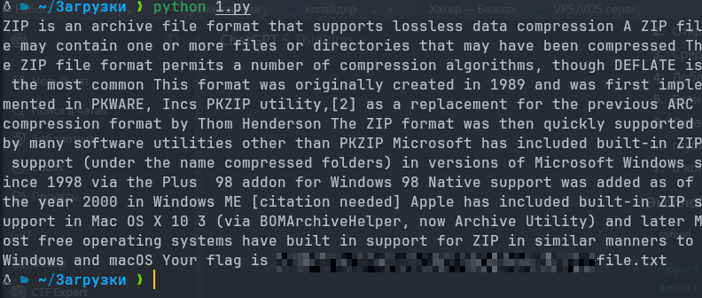

# Boom in a Boom

## Overview

**Категория:** MISC  
**Описание:** Хоть она и учебная - это не значит, что она не может навредить, будь аккуратнее!
**Сложность:** Easy

---
## Анализ

### Разведка

Что у нас было:

- Файл: `bomb` (по факту — zip-архив без расширения)
- Из условия (и по структуре): внутри лежит `boom.zip`, который повторяется на каждом уровне
- В каждом уровне помимо `boom.zip` лежит файл с именем типа `.Z`, `.I` и т.п. — это и есть полезные символы

Первичная проверка:
```bash
file bomb
# покажет что-то вроде: Zip archive data
```

И если руками раскрыть первый уровень:
```bash
unzip bomb -d level_0
ls level_0
# .Z
# boom.zip
```

Сразу видно паттерн: один “символьный” файл + ещё один архив.

### Детальный анализ

Пытаться “распаковать всё” обычным `unzip -r` нельзя — это по сути zip-bomb-паттерн: каждый следующий слой хранится внутри предыдущего, и можно легко получить очень много вложений.

Но структура простая:

- на уровне _n_ есть:
    - файл-символ (имя начинается с точки, дальше — символ)
    - `boom.zip` — следующий уровень
- надо:
    1. вытащить символ из имени файла
    2. открыть следующий `boom.zip` в памяти
    3. повторить, пока внутри уже нет `boom.zip`

Это удобно делать не через создание 1000 папок, а прямо в памяти — Python позволяет открыть zip из байтов (`io.BytesIO`).

---
## Решение

### Подход

1. Прочитать исходный архив как байты.
2. Открыть его как `ZipFile`.
3. Среди имён внутри взять **не** `boom.zip` — это и будет наш символ.
4. Добавить символ в итоговую строку.
5. Если внутри есть `boom.zip` — прочитать его содержимое в байты и повторить цикл.
6. Остановиться, когда `boom.zip` больше нет (или если мы достигли искусственного лимита глубины, чтобы не зациклиться).
7. В конце напечатать собранную строку — в ней и будет флаг.

### Эксплойт / Скрипт

```python
import zipfile
import io
from pathlib import Path

def read_nested_zip_chars(path, inner_name="boom.zip", max_depth=5000):
    # читаем исходный "bomb" целиком в память
    data = Path(path).read_bytes()
    chars = []
    depth = 0

    while True:
        zf = zipfile.ZipFile(io.BytesIO(data), "r")
        names = zf.namelist()

        # среди файлов будет односимвольный (типа ".Z") и сам boom.zip
        non_boom = [n for n in names if n != inner_name]
        if non_boom:
            name = non_boom[0]
            # в задаче имена вида ".X", берём символ после точки
            ch = name[1:] if name.startswith(".") else name
            chars.append(ch)

        # если есть следующий уровень — идём дальше
        if inner_name in names and depth < max_depth:
            data = zf.read(inner_name)
            depth += 1
        else:
            break

    return "".join(chars)

if __name__ == "__main__":
    result = read_nested_zip_chars("bomb")
    print(result)
```

### Шаги выполнения

1. Сохранили файл из задания как `bomb` рядом со скриптом.
2. Запустили скрипт: `python solve.py`.
3. Скрипт прошёл по всем вложенным `boom.zip` и собрал символы из имён файлов.
4. В конце получилась строка, в которой был флаг.


---

## Инструменты

- Python3
