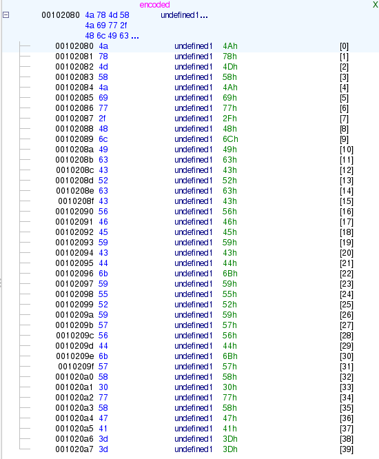

# ЗаБАГованная башня

## Overview

**Категория:** REV  
**Описание:** На сколько оптимальный алгоритм решения вы можете найти?
**Сложность:** Medium

---
## Анализ

### Разведка
Что мы получили:
- Один ELF-бинарь `hanoi`.
- При запуске:
    - спрашивает имя игрока;
    - выводит правила «Ханойской башни»;
    - позволяет вводить ходы в формате `from to` (например, `0 2`);
    - `-1 -1` — выход.
Быстрый осмотр:
- `file hanoi` → 64-bit ELF.
- `checksec` → типичная для CTF защита, без сюрпризов.
- `strings hanoi` показывает:
    - русские строки про «ХАНОЙСКУЮ БАШНЮ»;
    - строку `"Bug"`;
    - base64-подобную строку (кандидат на шифртекст флага).
Дальше открываем бинарь в Ghidra/IDA и смотрим функции.
Ключевые моменты из `main`:

1. Читает имя в `local_4a8`.
2. Инициализирует три башни (по сути — стеки) в массиве `local_4f8`.
3. Кладёт на башню 0 четыре кольца (4,3,2,1) через `push`.
4. В цикле:
    - рисует состояние башен `displayTowers`;
    - проверяет окончание игры:     
 ```c
    bool isGameComplete(long towers) {
        return *(int *)(towers + 0x38) == 3;
    }
```
    то есть игра закончена, когда на башне 2 (индекс 2) лежит 4 диска (top == 3);
    - читает ход `scanf("%d %d", &from, &to)`;
    - проверяет валидность хода `isValidMove` и делает `pop/push`;    
    - увеличивает счётчик ходов и **логирует** ход:
```c
    sprintf(local_4b2, "1%d%d", from, to);
    strcat(local_3f8, local_4b2);
```

Каждый ход записывается как **три цифры**:
- первая всегда `'1'`,
- вторая — номер башни «откуда» (0/1/2),
- третья — «куда» (0/1/2).

Примеры:
- `0 1` → `"101"`,
- `0 2` → `"102"`,
- `2 0` → `"120"` и т.д.

Все такие тройки конкатенируются в строку `local_3f8`.
После выхода из игрового цикла:
```c
printf("Количество ходов: %d\n", moves);

if (strcmp(local_4a8, "Bug") == 0) {
    local_500 = digitsToAsciiString(local_3f8);
    decode_text(encoded, local_500, local_468);
    putchar('\n');
}
```

То есть:
- если имя игрока **строго `"Bug"`**,
- то строка ходов превращается в ключ, и вызывается `decode_text`.
Разбор вспомогательных функций:
#### digitsToAsciiString
```c
result[i] =
    (param_1[i]   - '0') * 100 +
    (param_1[i+1] - '0') * 10 +
    (param_1[i+2] - '0');
```

Берётся каждая тройка цифр `"abc"` и интерпретируется как десятичный ASCII-код:
- `"065"` → `65` → `'A'`.
У нас же тройки вида `"1xy"`, где `x,y ∈ {0,1,2}`:
- код = `100 + 10*x + y` → диапазон `[100..122]` → буквы `'d'..'z'`.
То есть **последовательность ходов кодирует строку-ключ** для XOR.
#### decode_text + xor_crypt
```c
void decode_text(encoded, key, outbuf) {
    char tmp[1000];
    int len = 0;

    base64_decode(encoded, tmp, &len);
    tmp[len] = 0;
    xor_crypt(tmp, outbuf, key);
    printf("%s", outbuf);
}
```

`xor_crypt` делает обычный XOR-шифр:

```c
for (i = 0; tmp[i] != '\0'; i++) {
    outbuf[i] = tmp[i] ^ key[i % key_len];
}
outbuf[len] = '\0';
```

Итого:

> `flag = XOR( base64_decode(encoded), key_из_ходов )`,  
> но только если имя `"Bug"` и игра завершена.

Остаётся:
1. найти правильную последовательность ходов;
2. получить из неё ключ;
3. расшифровать base64+XOR.
#### Ходы Ханойской башни (4 диска)
Игра — классические «Ханойские башни» с 4 дисками:
- старт: башня 0,
- цель: башня 2,
- вспомогательная: башня 1.

Минимальное количество ходов для `n = 4` — `2^4 − 1 = 15`.  
Для такой задачи минимальное решение единственно.

Стандартное решение (from → to):

1. 0 → 1
2. 0 → 2
3. 1 → 2
4. 0 → 1
5. 2 → 0
6. 2 → 1
7. 0 → 1
8. 0 → 2
9. 1 → 2
10. 1 → 0
11. 2 → 0
12. 1 → 2
13. 0 → 1
14. 0 → 2
15. 1 → 2

Строка с ходами, которую соберёт программа:
`"101102112101120121101102112110120112101102112"`

Прогоняем через `digitsToAsciiString` — получаем ключ:
`"efpexyefpnxpefp"`

Дальше остаётся расшифровать глобальную строку `encoded`.  
В памяти она выглядит так:

`4a 78 4d 58 4a 69 77 2f 48 6c 49 63 43 52 63 43 56 46 45 59 43 44 6b 59 55 52 59 57 56 44 6b 57 58 30 77 58 47 41 3d 3d`

Это ASCII:
`xxxxxxxxxxxxxxxxxxxxxxxxxxxxxxxx`
Base64-декод → XOR с ключом `"efpexyefpnxpefp"` → флаг.

---
### Шаги выполнения

1. **Первичный анализ**
    - `file hanoi` — убеждаемся, что это 64-бит ELF.
    - `strings hanoi` — находим строку `"Bug"` и base64-строку `xxxxxxxxxxxxxxxxxxxxxxxxxxxxxxxx`.
2. **Реверс в Ghidra**
    - Открываем бинарь.
    - Находим `main`, видим игру в «Ханойскую башню» (три башни, функции `push`, `pop`, `displayTowers`).
    - Обнаруживаем проверку `strcmp(name, "Bug")` и вызов `decode_text(encoded, key, outbuf)`.
3. **Анализ логирования ходов и генерации ключа**
    - В `main` на каждый ход:
        `sprintf(local_4b2, "1%d%d", from, to); strcat(local_3f8, local_4b2);`
    - В `digitsToAsciiString` каждые 3 цифры → десятичный ASCII-код → символ.
        Значит, последовательность ходов однозначно задаёт XOR-ключ.
4. **Решаем Ханой минимально**
    - Понимаем, что нужно переложить 4 диска с башни 0 на башню 2.
    - Строим минимальную последовательность из 15 ходов (0→1, 0→2, 1→2, …, 1→2).
    - Собираем строку `"101102112101120121101102112110120112101102112"`.
5. **Получаем ключ**
    - Пишем небольшой скрипт (или руками реализуем `digitsToAsciiString`):
```python
def digits_to_ascii_string(s: str) -> bytes:
    out = []
    for i in range(0, len(s), 3):
        if i + 2 < len(s):
            a = ord(s[i])   - ord('0')
            b = ord(s[i+1]) - ord('0')
            c = ord(s[i+2]) - ord('0')
            code = 100*a + 10*b + c
            out.append(code)
    return bytes(out)

digits = "101102112101120121101102112110120112101102112"
key = digits_to_ascii_string(digits)
print(key)            # b'efpexyefpnxpefp'

```
    - Ключ: `b"efpexyefpnxpefp"`.
6. **Декодируем флаг**
    - Берём строку `encoded = "xxxxxxxxxxxxxxxxxxxxxxxxxxxxxxxx"`.
    - Пишем декодер:
```python
import base64

encoded = "xxxxxxxxxxxxxxxxxxxxxxxxxxxxxxxx"
key = b"efpexyefpnxpefp"

cipher = base64.b64decode(encoded)
plain = bytes(c ^ key[i % len(key)] for i, c in enumerate(cipher))

print(plain.decode())
```
    - На выходе получаем флаг:
1. **Проверка «вручную» (опционально)**
    - Запускаем `./hanoi`.
    - Вводим имя: `Bug`.
    - Делаем 15 ходов в нужной последовательности.
    - Программа сама выводит:
    `Поздравляем, Bug! Вы решили головоломку! Количество ходов: 15 Флаг: `

---

## Полезные ссылки
