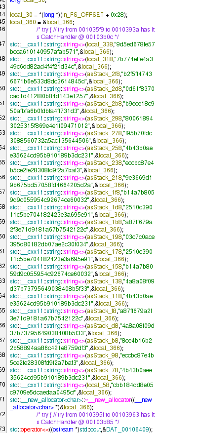

# Почувствуй радугу

## Overview

**Категория:** REV  
**Описание:** Больше хешей – надежнее. Или нет?

Задача на реверс-инжиниринг бинарного файла, который проверяет флаг через MD5-хеши отдельных символов.

---

## Анализ

### Разведка

Получили исполняемый файл `md5_flag_checker`. При анализе в дизассемблере обнаружена нестандартная схема проверки флага.

### Точка входа

В `_start` вызывается обычный `__libc_start_main(main, ...)` — всё стандартно. Настоящая логика в `main`.

### Что делает main

В `main` создаётся **24 (0x18) строк** вида:
```
9d5ed678fe57bcca610140957afab571 7b774effe4a349c6dd82ad4f4f21d34c b2f5ff47436671b6e533d8dc3614845d ...
```

Программа заранее забивает в память **24 MD5-хеша в виде строк**.



Алгоритм работы:
1. Программа выводит приглашение
2. Читает строку через `std::getline`
3. Проверяет, что длина ввода **ровно 24 байта**
4. Выполняет цикл проверки:

```c
for (i = 0; i < 0x18; i++) {
    ch = input[i];
    if (check_char_md5(ch, &md5_list[i]) != 1) {
        // wrong
    }
}
```

Это **не** проверка одного общего MD5 от всей строки — это **24 независимых проверки**: на i-й позиции должен стоять символ, MD5 от которого совпадает с i-м хешем из списка.

### Функция check_char_md5

```c
ulong check_char_md5(char param_1, string *param_2)
{
  char buf[1];
  string md5str;

  buf[0] = param_1;
  calculate_md5((uchar *) &md5str, (ulong) buf);
  bool ok = (md5str == *param_2);
  md5str.~string();
  return ok;
}
```

Смысл: взять **один символ**, посчитать от него MD5, получить строку из 32 hex-символов и сравнить с переданным образцом.

### Функция calculate_md5

Стандартная реализация MD5:
- Инициализация констант: `0x67452301, 0xefcdab89, 0x98badcfe, 0x10325476`
- Дописывание 0x80, выравнивание по 64 байта
- Вызов `MD5_Transform(...)`
- Форматирование результата через `sprintf("%02x", ...)`

---

## Решение

### Подход

Раз у нас 24 MD5-строки и мы знаем, что каждая — это MD5 от **одного символа**, достаточно перебрать все печатные ASCII и найти, какой символ даёт нужный хеш.

### Эксплойт

```python
import hashlib

hashes = [
"9d5ed678fe57bcca610140957afab571",
"7b774effe4a349c6dd82ad4f4f21d34c",
"b2f5ff47436671b6e533d8dc3614845d",
"0d61f8370cad1d412f80b84d143e1257",
"b9ece18c950afbfa6b0fdbfa4ff731d3",
"800618943025315f869e4e1f09471012",
"f95b70fdc3088560732a5ac135644506",
"4b43b0aee35624cd95b910189b3dc231",
"eccbc87e4b5ce2fe28308fd9f2a7baf3",
"9e3669d19b675bd57058fd4664205d2a",
"b14a7b8059d9c055954c92674ce60032",
"2510c39011c5be704182423e3a695e91",
"a87ff679a2f3e71d9181a67b7542122c",
"03c7c0ace395d80182db07ae2c30f034",
"2510c39011c5be704182423e3a695e91",
"b14a7b8059d9c055954c92674ce60032",
"4a8a08f09d37b73795649038408b5f33",
"4b43b0aee35624cd95b910189b3dc231",
"a87ff679a2f3e71d9181a67b7542122c",
"4a8a08f09d37b73795649038408b5f33",
"8ce4b16b22b58894aa86c421e8759df3",
"eccbc87e4b5ce2fe28308fd9f2a7baf3",
"4b43b0aee35624cd95b910189b3dc231",
"cbb184dd8e05c9709e5dcaedaa0495cf",
]

# печатные ASCII
candidates = ''.join(chr(i) for i in range(32, 127))

flag_chars = []
for h in hashes:
    for ch in candidates:
        if hashlib.md5(ch.encode()).hexdigest() == h:
            flag_chars.append(ch)
            break

flag = ''.join(flag_chars)
print(flag)
```

### Шаги выполнения

1. Извлечь список из 24 MD5-хешей из бинарного файла
2. Для каждого хеша перебрать все печатные ASCII-символы
3. Найти символ, чей MD5 совпадает с текущим хешом
4. Собрать все символы в одну строку
5. Получить флаг
