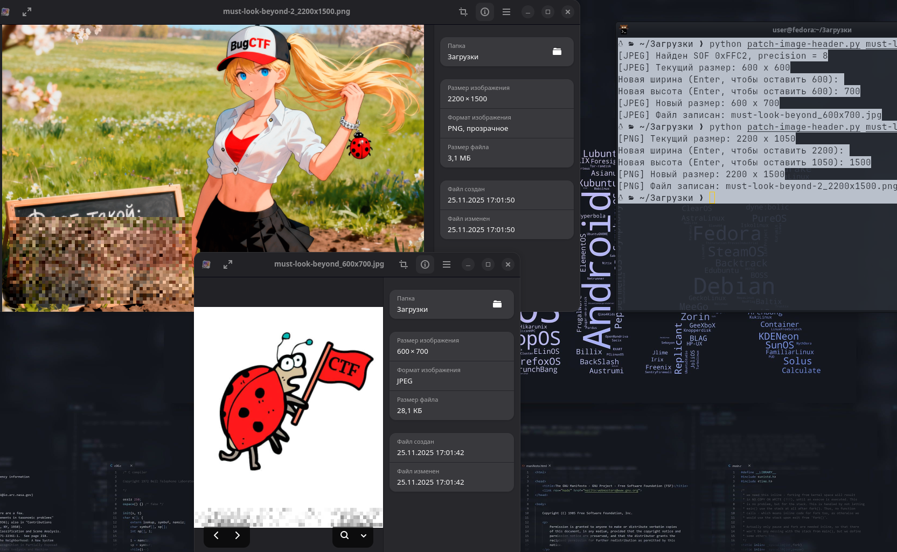

## Границы лишь в голове 1-2

## Overview

**Категория:** Stego
**Сложность:** Easy / Medium
**Описание:** Серия из две похожих задач. 
### Задачи серии

1. Границы лишь в голове - Чтобы добиться хороших результатов, иногда нужно выходить за очерченные границы
2. Границы лишь в голове #2 - В ночь перед релизом обнаружена ошибка — задача повторят первую часть(задача "Границы лишь в голове"), если работать с картинкой в ОС Windows. Задуманное решение доступно только в MacOs и Linux. Но чтобы совсем не убирать задачу и сделать на нее интересный разбор, задача опубликована сразу с минимальным баллом.

---

## Анализ

### Разведка
Что нам выдали:
- `must-look-beyond.jpg`
- `must-look-beyond-2.png`

Первичные шаги:
- Открываем изображения в обычном просмотрщике — ничего очевидного, просто картинки.
- Делаем стандартный набор форенсики: `file`, `exiftool`, `strings`, `binwalk` — ничего интересного, флага в явном виде нет.
- Обращаем внимание на **название задачи/файлов** — _must look beyond_ намекает, что нужно «смотреть дальше» — возможно, **за пределами видимой части изображения**.

Проверка размеров:
- При просмотре свойств файлов/загрузке в скрипт видим размеры:
    - JPEG: `600 x 600`
    - PNG: `2200 x 1050`

Идея: иногда в стего-задачах реальный объём пиксельных данных **больше**, чем размер, заявленный в заголовке. Тогда отображается только «верхняя часть» картинки, а в «хвосте» лежит ещё что-то (например, флаг).

---
### Детальный анализ

#### PNG
Формат PNG:
- Сигнатура: 8 байт `\x89PNG\r\n\x1a\n`
- Первый чанк — `IHDR` (тип `b"IHDR"`), в нём:
    - `width` (4 байта, big-endian)        
    - `height` (4 байта, big-endian)
- В конце чанка — CRC-32 от `type + data`.

Идея:  
Если **внутри IDAT/пиксельных данных** закодировано больше строк, чем написано в `height`, можно «поднять» высоту и заставить декодер отрисовать лишние строки — там и окажется флаг.

В скрипте:
- Читаем PNG.
- Проверяем сигнатуру.
- Находим первый чанк `IHDR`.
- Считываем ширину/высоту, выводим текущий размер.
- Спрашиваем у пользователя новые значения.
- Перезаписываем `width`/`height` и **пересчитываем CRC чанка IHDR**.    

#### JPEG

Формат JPEG:
- Начинается с `SOI` (`0xFFD8`).
- Дальше идут разные сегменты: APPx, DQT, SOF, DHT и т.д.
- Реальные размеры изображения лежат в сегменте **SOF** (Start Of Frame):
    - Байты: `[length][precision][height][width]...`
    - Высота и ширина по 2 байта (big-endian).

Логика:
- Ищем маркер `0xFF` + один из **SOF-маркеров** (`0xC0, 0xC2`, и др.) из набора `SOF_MARKERS`.
- Когда находим — читаем `height` и `width`.
- Меняем их на новые (бОльшие) значения.
- Сохраняем файл как новый JPEG.

После этого при открытии изображения просмотрщик попытается отрисовать **больше строк**, чем раньше, и начнёт вытягивать лишние данные из потока — флаг проявится в «дополненной» части картинки.

---

## Решение

### Подход
1. Написать универсальный скрипт, который:
    - Определяет формат (PNG/JPEG) по сигнатуре.
    - Аккуратно правит **только поля размера** в заголовке.
    - Для PNG пересчитывает CRC `IHDR`.
2. С его помощью увеличить высоту:
    - для JPEG: с `600` до `700`;
    - для PNG: с `1050` до `1500` (или похожего значения).
3. Открыть полученные файлы в просмотрщике: во «вылезшей» нижней части изображения оказывается флаг.
### Эксплойт / Скрипт

Упрощённая версия основного скрипта `patch-image-header.py` (без всего boilerplate, только ключевые куски):

```python
#!/usr/bin/env python3
import struct
import zlib
import sys
from pathlib import Path

PNG_SIG = b"\x89PNG\r\n\x1a\n"
JPEG_SOI = b"\xFF\xD8"

SOF_MARKERS = {
    0xC0, 0xC1, 0xC2, 0xC3,
    0xC5, 0xC6, 0xC7,
    0xC9, 0xCA, 0xCB,
    0xCD, 0xCE, 0xCF,
}

def ask_dim(name: str, old_value: int) -> int:
    s = input(f"Новая {name} (Enter, чтобы оставить {old_value}): ").strip()
    if not s:
        return old_value
    try:
        v = int(s)
        return v if v > 0 else old_value
    except ValueError:
        return old_value

def patch_png_file(in_path: Path):
    data = bytearray(in_path.read_bytes())
    if data[:8] != PNG_SIG:
        raise ValueError("Это не PNG")

    off = 8
    length = struct.unpack(">I", data[off:off+4])[0]
    chunk_type = data[off+4:off+8]
    if chunk_type != b"IHDR" or length != 13:
        raise ValueError("Странный PNG / IHDR")

    ihdr_start = off + 8
    ihdr_end = ihdr_start + length
    ihdr = bytearray(data[ihdr_start:ihdr_end])

    old_w, old_h = struct.unpack(">II", ihdr[0:8])
    print(f"[PNG] Текущий размер: {old_w} x {old_h}")
    new_w = ask_dim("ширина", old_w)
    new_h = ask_dim("высота", old_h)

    ihdr[0:4] = struct.pack(">I", new_w)
    ihdr[4:8] = struct.pack(">I", new_h)

    new_crc = zlib.crc32(chunk_type + ihdr) & 0xFFFFFFFF
    data[ihdr_start:ihdr_end] = ihdr
    data[ihdr_end:ihdr_end+4] = struct.pack(">I", new_crc)

    out_path = in_path.with_name(f"{in_path.stem}_{new_w}x{new_h}{in_path.suffix}")
    out_path.write_bytes(data)
    print(f"[PNG] Новый размер: {new_w} x {new_h}")
    print(f"[PNG] Файл записан: {out_path}")

def patch_jpeg_file(in_path: Path):
    data = bytearray(in_path.read_bytes())
    if data[:2] != JPEG_SOI:
        raise ValueError("Это не JPEG")

    i = 2
    while i < len(data):
        if data[i] != 0xFF:
            i += 1
            continue
        while i < len(data) and data[i] == 0xFF:
            i += 1
        if i >= len(data):
            break

        marker = data[i]; i += 1
        if marker in (0xD8, 0xD9, 0x01) or 0xD0 <= marker <= 0xD7:
            continue

        if i + 2 > len(data):
            break
        seg_len = struct.unpack(">H", data[i:i+2])[0]

        if marker in SOF_MARKERS:
            p = i + 2
            precision = data[p]
            old_h = struct.unpack(">H", data[p+1:p+3])[0]
            old_w = struct.unpack(">H", data[p+3:p+5])[0]
            print(f"[JPEG] Найден SOF 0xFF{marker:02X}, precision = {precision}")
            print(f"[JPEG] Текущий размер: {old_w} x {old_h}")

            new_w = ask_dim("ширина", old_w)
            new_h = ask_dim("высота", old_h)

            if new_w > 65535 or new_h > 65535:
                new_w &= 0xFFFF
                new_h &= 0xFFFF

            data[p+1:p+3] = struct.pack(">H", new_h)
            data[p+3:p+5] = struct.pack(">H", new_w)

            out_path = in_path.with_name(f"{in_path.stem}_{new_w}x{new_h}{in_path.suffix}")
            out_path.write_bytes(data)
            print(f"[JPEG] Новый размер: {new_w} x {new_h}")
            print(f"[JPEG] Файл записан: {out_path}")
            return

        i += seg_len

    raise ValueError("SOF-сегмент не найден")

def main():
    if len(sys.argv) < 2:
        print(f"Использование: {sys.argv[0]} image.(png|jpg|jpeg)")
        sys.exit(1)
    in_path = Path(sys.argv[1])
    head = in_path.read_bytes()[:10]
    if head.startswith(PNG_SIG):
        patch_png_file(in_path)
    elif head.startswith(JPEG_SOI):
        patch_jpeg_file(in_path)
    else:
        print("Неподдерживаемый формат")

if __name__ == "__main__":
    main()
```

### Шаги выполнения

1. **Запускаем скрипт для JPEG:**  
```bash
    python patch-image-header.py must-look-beyond.jpg
```
    - Скрипт показывает текущий размер: `600 x 600`.
    - На вопрос про новую высоту вводим, например, `700`.
    - Получаем файл вида: `must-look-beyond_600x700.jpg`.

2. **Открываем новый JPEG** любым просмотрщиком — внизу картинки появляются дополнительные строки, в которых читается флаг. 

3. **Повторяем то же для PNG:**
```bash
    python patch-image-header.py must-look-beyond-2.png
```
    - Скрипт показывает: `2200 x 1050`.
    - Увеличиваем высоту, например, до `1500`.
    - Открываем `must-look-beyond-2_2200x1500.png` — в расширенной части снова появляется флаг/подтверждение.
4. **Флаг** (записываем из изображения):  
    `BugCTF{...}`
