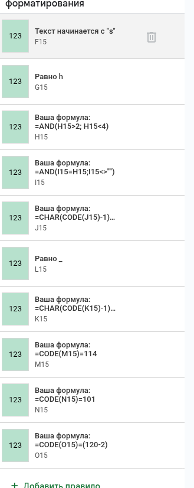

# Реверс в Excel

## Overview

**Категория:** REV  
**Сложность:** Easy  

Нужно восстановить все символы флага так, чтобы они соответсвовали правилам условного форматирования в гугловой таблице.

Ссылка на таблицу: 
[https://docs.google.com/spreadsheets/d/14_eCC-Qyse0uUgxdm8yl5HDIJz9Jrqy7ZcdB7K_Na6Y/edit?gid=0#gid=0](https://docs.google.com/spreadsheets/d/14_eCC-Qyse0uUgxdm8yl5HDIJz9Jrqy7ZcdB7K_Na6Y/edit?gid=0#gid=0)
---

## Анализ

### Разведка

1. Открываем файл в Google Sheets / Excel.
2. Находим строку, похожую на флаговую (в задаче это диапазон **B15:Q15**).
3. Открываем **Format → Conditional formatting** и смотрим все правила, которые применяются к этой строке.

---

### Детальный анализ

Из правил условного форматирования для **B15:Q15** получается
- `B15 = "Bug"`
- `D15` может быть `"L3"` или `"CTF"`, выбираем `"CTF"` → классический префикс `BugCTF`.
- `E15 = "{"`
- `F15` — текст, начинающийся с `"s"` → берём `"s"`.
- `G15 = "h"`
- `H15 > 2` и `H15 < 4` → `H15 = 3`
- `I15 = H15` и не пусто → `I15 = 3` → вместе даёт `33`.
- `L15 = "_"`

Дальше идут проверки через `CODE` / `CHAR`
- `CODE(M15) = 114` → `M15 = "r"`
- `CODE(N15) = 101` → `N15 = "e"`
- `CODE(O15) = 120 - 2 = 118` → `O15 = "v"` → `"rev"`

Цепочка отношений между символами:
- `CHAR(CODE(K15) - 1) = M15` → если `M15 = "r"`, то `K15 = "s"`.
- `CHAR(CODE(J15) - 1) = K15` → если `K15 = "s"`, то `J15 = "t"`.

Концевые ячейки:
- `P15 = "}"`, (в таблице две скобки, для флага достаточно одной).

---
## Решение

### Подход

1. Открыть файл в Google Sheets (или Excel, но в Sheets удобнее разбирать формулы условного форматирования).
2. Найти диапазон, где потенциально хранится флаг (в задаче это была строка 15).
3. Открыть панель **Format → Conditional formatting** и посмотреть все правила, которые применяются к B15:Q15.
4. Переписать формулы в привычном виде и по шагам вывести значения всех ячеек:
    - текстовые проверки (`="Bug"`, `"CTF"`, `"{"`, `"}"`, `"_"`, `"h"`, и т.д.),
    - числовые ограничения (`>2`, `<4`),
    - связи между символами через `CODE`/`CHAR`,
    - проверки регулярками (`REGEXMATCH(..., "^s")`).
5. Склеить найденные символы в одну строку и привести к стандартному формату флага.
### Шаги выполнения

1. **Открываем файл** `Реверс в экселе.xlsx` в Google Sheets.
2. **Переходим в** `Format → Conditional formatting` и выбираем диапазон **B15:Q15**
3. **Выписываем все условия** (особенно те, что используют `CODE`, `CHAR`, `REGEXMATCH`, сравнения строк и чисел).
4. **Решаем систему ограничений**:
    - подбираем значения для `B15`, `C15`, `D15`, `E15`, `F15`, `G15`, `H15`, `I15`, `J15`, `K15`, `L15`, `M15`, `N15`, `O15`, `P15`, `Q15`,
    - убеждаемся, что все правила условного форматирования подсвечиваются (истинны).

